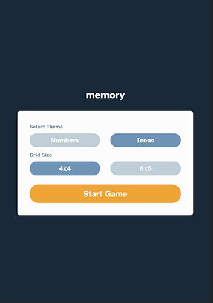
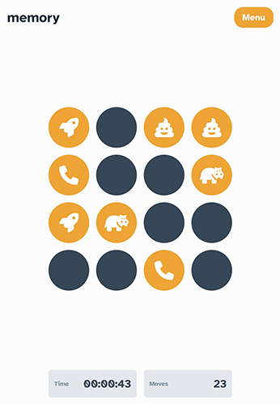
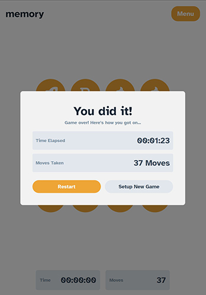
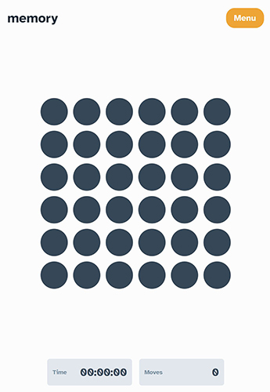

# Memory Game

Its a small game tha helps you keep your memory sharp while trying to match pairs of icons or numbers in a 4x4 or 6x6 grid!

## Build with

- React.js
- Framer-motion
- Fontawesome

## What i learned

This project was excellent to test my React.js skills and it was very fun to do!
I used Fisher-Yates algorithm for the numbers and icons so they could have the same probability of randomness.
Thats actually helped me to shuffle the array and make me understand the importance of algorithms even for small projects like this.

- a better understanding how to use useReducer, useCallback hooks ,React memo and why.

- framer-motion animations.

- Responsive design.

## Future Improvements

- multiplayer support.
- user high score

## [Live Demo](https://antonis-maras-memory.netlify.app/)
